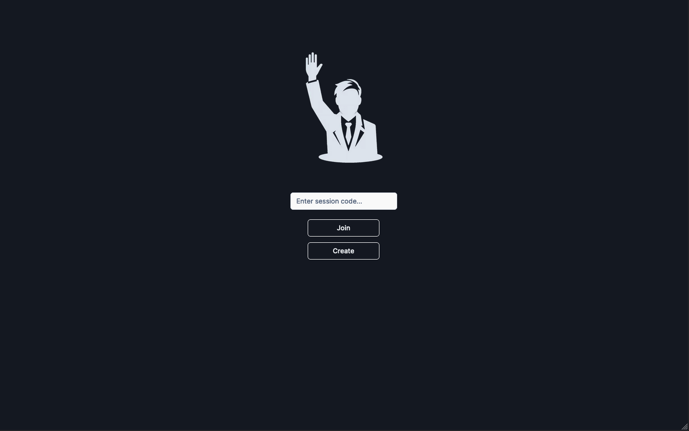
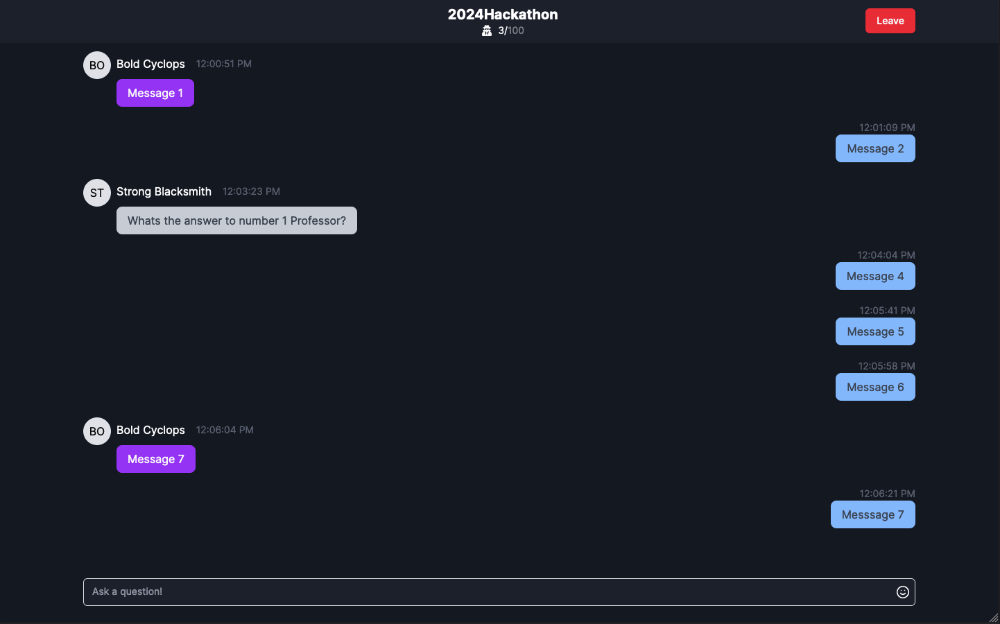
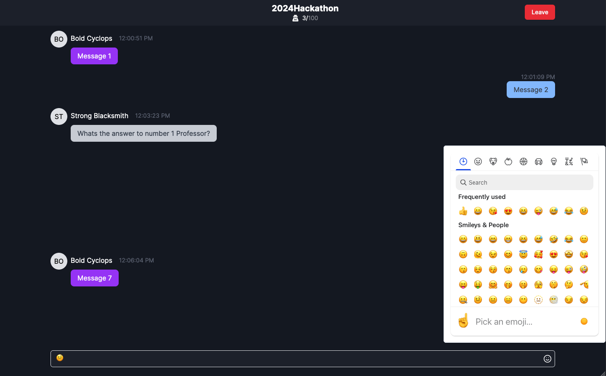

# AskAnon

Get answers from your professor during lecture anonymously in real-time.

## What it Does

AskAnon allows verified professors at Rutgers to create anonymous live chat sessions. Creating a session generates a unique session ID that students can enter on the site to join the lecture chat and ask questions without the fear of asking a "stupid question."

## Inspiration

This semester in Deep Learning, our professor Dr. Cowan observed that many students were hesitant to ask questions. To address this, he started using a Google Doc to enable students to anonymously ask questions. The result has been a dramatic increase in engagement throughout the semester.

Inspired by this success, we developed a platform that allows professors to facilitate anonymous question submission during lectures, encouraging more students to participate and engage without fear.

We're hoping that by providing a platform that professors can use during lecture to allow students to anonymously ask questions, students will feel more inclined to participate and ask questions.

## How We Built It

We leveraged the Next.js framework to develop the site, utilizing Firebase as our database to store session message histories and new messages. For authentication, we integrated Auth0, which facilitates user and professor logins and verifies professors to enable session creation. Additionally, Auth0 ensures that users are authenticated with a Rutgers email domain.

## Built With

- Auth0
- Firebase
- Next.js
- Tailwind

